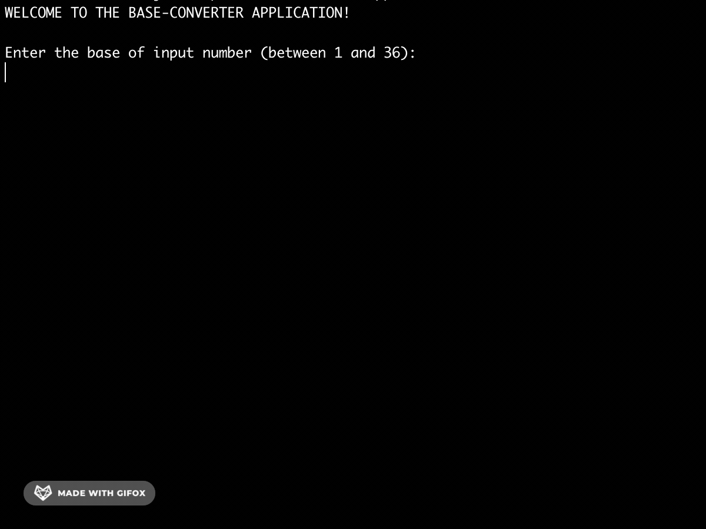

# RadixConverter

RadixConverter is a console utility that allows you to perform number conversion from one numeral system to another.

The utility allows you to convert an integer or a fractional number from/to any radices between 1 and 36.



## Prerequisites

Before you begin, ensure you have met the following requirements:
* You have installed `JDK 7` or later.
* You have a `Windows/Linux/Mac` machine.

## Using RadixConverter

To use RadixConverter, follow these steps:

Simply run it from your favorite IDE.

or

Compile and run RadixConverter using command line.

Inside the project directory run the following commands in order to compile and run RadixConverter.

#### Linux/Mac
compile:
```
javac -cp src/underhill/nick/*.java
```
run:
```
java -cp src underhill.nick.App
```
#### Windows
compile:
```
javac -cp src\underhill\nick\*.java
```
run:
```
java -cp src underhill.nick.App
```

## Contributing
Pull requests are welcome. For major changes, please open an issue first to discuss what you would like to change.

## Contact

If you want to contact me you can reach me at `m.podopryhora@gmail.com`

## License
[MIT](https://choosealicense.com/licenses/mit/)
